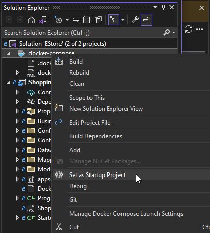

# manning-liveproject-automated-testing-for-csharp

Coding as part of completing the work in https://www.manning.com/liveprojectseries/automated-testing-for-C-developers-ser

## Changing the startup project in Visual Studio 2022

In the Solution Explorer use right-click on `docker-compose` to change the startup project in Visual Studio.

